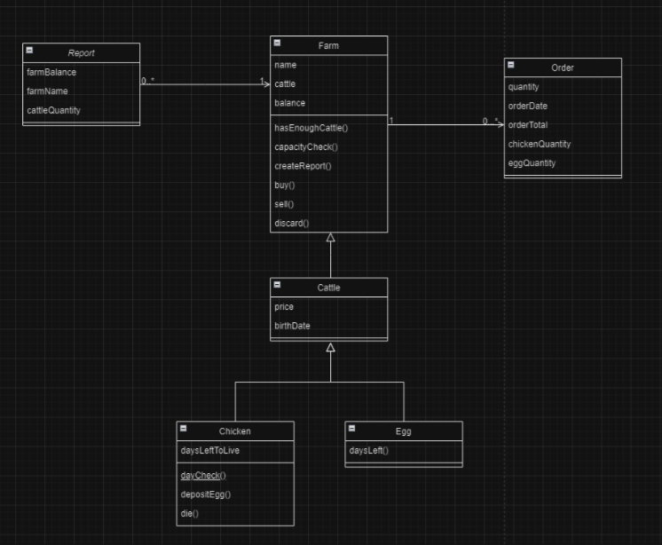
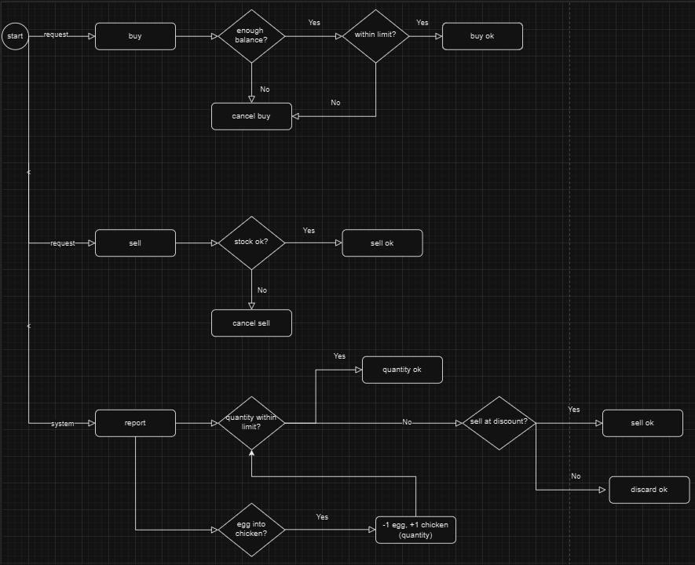

Chickentest
---------------------------------------

_Description_

- This project serves the purpose of 
managing a farm in a day-to-day basis,
with two kinds of cattle, 
chickens and eggs. It fulfills the following
goals:
  - Me, as a farmer, can own a farm, eggs and
  chickens.
  -  I can also buy and sell them,
  - and finally, I need to be able to see a 
  status report of the farm, including capacity, 
  money and cattle.
- UML Diagram: 

- Functional diagram: 
---------------------------------------
_Prerequisites_

- To be able to run this program, you should:
  - Have Windows 10 or above installed
  - Have an API platform installed like Postman, to import cURLs, follow these steps:
    * Open Postman and click on the "Import" button located in the top left corner of the screen. 
    * In the Import dialogue box, select the "Raw Text" option. 
    * Paste your cURL command into the text box. 
    * Click on the "Continue" button, then click the last "Import" button to generate the request in Postman
  - Have Java 17 installed
  - Have a Java IDE installed 
  (be it Intellij, Eclipse...)
  - Set up a connection with a database in MySQL Workbench
  - Framework: Springboot 3.3.4
---------------------------------------
_Features - Endpoints_

- Chicken controller:
  - (post) localhost:8080/api/v1/chicken/add. Creates a 
  Chicken instance. Example input: 
  {
    "price":5,
    "daysLived":14
  }
    cURL:
    curl --location 'localhost:8080/api/v1/chicken/add' \
    --header 'Content-Type: application/json' \
    --data '{
    "price":5.05,
    "daysLived":5
    }'
    where the data sent in the body is to create a new Chicken, then the Chicken will be
    created in the database.
  - (get) localhost:8080/api/v1/chicken. Returns a
  list of all Chickens.
    cURL: curl --location 'localhost:8080/api/v1/chicken'
    This request returns a list of all Chickens, fetched from the database.
  - (get) localhost:8080/api/v1/chicken/get?id=X.
  Returns a chicken with the specified id.
    cURL: curl --location 'localhost:8080/api/v1/chicken/get?id=1'
    where the number in the URL stands for Chicken ID, this fetches the Chicken from 
    the database and returns the Chicken specified in the URL.
  - (put) localhost:8080/api/v1/chicken/update/X. Updates Chicken instance. Example input:
  {
  "price":5,
  "daysLived":5
  }
  cURL: curl --location --request PUT 'localhost:8080/api/v1/chicken/update/1' \
  --header 'Content-Type: application/json' \
  --data '{
  "price":6.6,
  "daysLived":6
  }'
  where the data sent in the body belongs to the Chicken data and the number sent in the URL
  stands for Chicken ID. This method fetches the specified Chicken in the URL 
  from the database and updates it.
  - (delete) localhost:8080/api/v1/chicken/delete/X.
  Deletes Chicken instance.
  cURL: curl --location --request DELETE 'localhost:8080/api/v1/chicken/delete/1'
  where the number in the URL stands for a Chicken ID. This fetches the Chicken from 
  the database and deletes the Chicken and also detaches it from the associated Farmer.
- Egg controller:
  - (post) localhost:8080/api/v1/egg/add. Creates 
  an Egg instance. Example input: 
  {
    "price":5.05,
    "daysLived":5
    }
  cURL:
    curl --location 'localhost:8080/api/v1/egg/add' \
    --header 'Content-Type: application/json' \
    --data '{
    "price":5.05,
    "daysLived":5
    }'
    where the data sent in the body is to create a new Egg, then the Egg will be
    created in the database.
  - (get) localhost:8080/api/v1/egg. Returns
  a list of all Eggs. 
  cURL: curl --location 'localhost:8080/api/v1/egg'
  This request returns a list of all Eggs, fetched from the database. 
  - (get) localhost:8080/api/v1/egg/get?id=X
  Returns an Egg with the specified id.
  cURL: curl --location 'localhost:8080/api/v1/egg/get?id=1'
  where the number in the URL stands for Egg ID, this fetches the Egg from the 
  database and returns the Egg specified in the URL. 
  - (put) localhost:8080/api/v1/egg/update/X.
  Updates Egg instance. Example input:
    {
    "price":6.6,
    "daysLived":6
    }
  cURL: curl --location --request PUT 'localhost:8080/api/v1/egg/update/1' \
    --header 'Content-Type: application/json' \
    --data '{
    "price":6.6,
    "daysLived":6
    }'
  where the data sent in the body belongs to the Egg data and the number sent in the URL
  stands for Egg ID. This method fetches the Egg from the database and updates it. 
  - (delete) localhost:8080/api/v1/egg/delete/X.
  Deletes Egg instance.
  cURL: curl --location --request DELETE 'localhost:8080/api/v1/egg/delete/1'
  where the number in the URL stands for an Egg ID. This fetches the Egg from the database
  and deletes the Egg and also detaches it from the associated Farmer. 
- Farmer controller:
  - (post) localhost:8080/api/v1/farmer/add.
  Creates a Farmer instance. Example input: 
  {
    "name":"Jack Marston",
    "balance":100,
    "farmLimit":4
    }
  cURL: curl --location 'localhost:8080/api/v1/farmer/add' \
    --header 'Content-Type: application/json' \
    --data '{
    "name":"Jack Marston",
    "balance":100,
    "farmLimit":4
    }'
  where the data sent in the body is to create a new Farmer, then the Farmer will be
  created in the database. 
  - (get) localhost:8080/api/v1/farmer
  cURL: curl --location 'localhost:8080/api/v1/farmer'
  Returns a list of all Farmers. 
  - (get) localhost:8080/api/v1/farmer/get?id=X
  Returns Farmer with specified id.
  cURL: curl --location 'localhost:8080/api/v1/farmer/get?id=1'
  where the number sent in the URL is the Farmer ID. This returns a single Farmer, fetched
  from the database.
  - (put) localhost:8080/api/v1/farmer/update/X.
  Updates Farmer instance. Example input:
    {
    "name":"Arthur Morgan",
    "balance":66.0,
    "farmLimit":25
    }
  cURL: curl --location --request PUT 'localhost:8080/api/v1/farmer/update/1' \
    --header 'Content-Type: application/json' \
    --data '{
    "name":"Arthur Morgan",
    "balance":66.0,
    "farmLimit":25
    }' where the data sent in the body is the Farmer data and the number sent in the URL 
  stands for the Farmer ID. This way, the farmer in the database will be modified with the
  data sent in the body.
  - (delete) localhost:8080/api/v1/farmer/delete/X.
  Deletes Farmer instance. 
  cURL: curl --location --request DELETE 'localhost:8080/api/v1/farmer/delete/2'
  where the number in the URL stands for Farmer ID. 
  - (post) localhost:8080/api/v1/farmer/buy/chicken/X.
  Buys Chickens for the specified Farmer id.
  Example input:
    [
    {
    "price":5,
    "daysLived":1
    },
    {
    "price":5,
    "daysLived":1
    }
    ]
  cURL: curl --location 'localhost:8080/api/v1/farmer/buy/chicken/3' \
    --header 'Content-Type: application/json' \
    --data '[
    {
    "price":5,
    "daysLived":1
    },
    {
    "price":5,
    "daysLived":1
    }
    ]' where the data sent in the body belongs to Chicken data. Once this request is sent
  these Chicken will be created in the database and associated to the specified Farmer in the URL.
  - (delete) localhost:8080/api/v1/farmer/sell/chicken/X.
  Sells Chickens specified in the body of the
  request for the specified Farmer id in the URL.
  Example input: [X, Y] where X, Y stand for Chicken id.
  cURL: curl --location --request DELETE 'localhost:8080/api/v1/farmer/sell/chicken/2' \
    --header 'Content-Type: application/json' \
    --data '[7, 8]' where [7,8] stand for Chicken IDs and 2 in the request stands for
  Farmer ID. 
  - (post) localhost:8080/api/v1/farmer/buy/egg/X.
    Buys Eggs for the specified Farmer id.
    Example input:
    [
    {
    "price":5,
    "daysLived":5
    },
    {
    "price":5,
    "daysLived":5
    }
    ]
  cURL: curl --location 'localhost:8080/api/v1/farmer/buy/egg/3' \
    --header 'Content-Type: application/json' \
    --data '[
    {
    "price":5,
    "daysLived":5
    },
    {
    "price":5,
    "daysLived":5
    }
    ]', this data are for Egg attributes. Once this is posted, the Eggs specified in the
  body will be created in the database and will be associated to the Farmer. 
  - (delete) localhost:8080/api/v1/farmer/sell/egg/X.
    Sells Eggs specified in the body of the
    request for the specified Farmer id in the URL.
    Example input: [X, Y] where X and Y stand for Egg id.
  cURL: curl --location --request DELETE 'localhost:8080/api/v1/farmer/sell/egg/1' \
    --header 'Content-Type: application/json' \
    --data '[1,2]' where [1,2] are Egg IDs.
  - (get) localhost:8080/api/v1/farmer/report/X/Y.
  Gets a report of the status of the farm for the Farmer
    (X in the URL, stands for Farmer id). For days to pass,
  we have to specify how many days should pass in the URL (Y,
  stands for days).
  cURL: curl --location 'localhost:8080/api/v1/farmer/report/3/3' where the first number
  is farmerId and the second stands for days. 